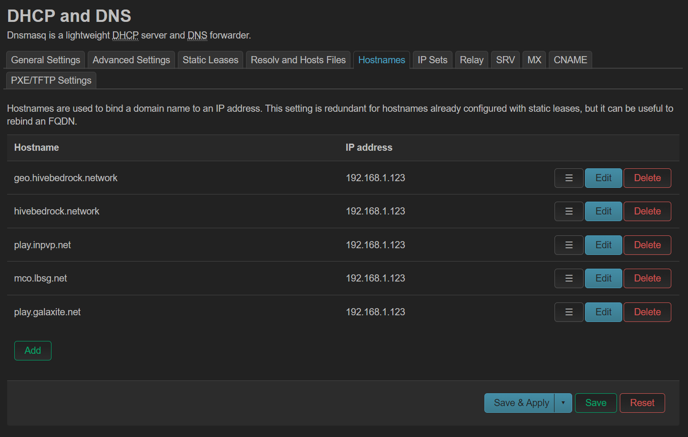

# Minecraft LAN Worlds

```
./start.sh
```

This will read [`minecraft/worlds.json`](minecraft/worlds.json) and start a server for each world using `docker compose`.

## Setup

### DNS

If you want to connect to the servers via the Nintendo Switch, you will need to make sure you have DNS entries set to point to your host server (for [BedrockConnect](https://github.com/Pugmatt/BedrockConnect)):

| Hostname |
| -------- |
| geo.hivebedrock.network |
| hivebedrock.network |
| play.inpvp.net |
| mco.lbsg.net |
| play.galaxite.net |

This is necessary because on Minecraft Bedrock Edition, players on Xbox One, Nintendo Switch, and PS4/PS5 are limited to playing on "Featured Servers" approved by Mojang/Microsoft. These players are not able to join Java Edition servers via an IP address.

BedrockConnect gets around this by acting as a proxy server that allows players to redirect to a server of their choice.

To allow that, we hijack DNS requests to the featured servers and redirect them to our local BedrockConnect server.


